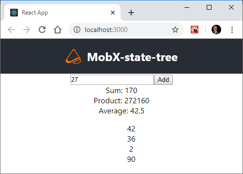

# cra-template-mobx-state-tree-typescript

This is the MobX-state-tree TypeScript template for [Create React App](https://github.com/facebook/create-react-app).

To use this template, add `--template mobx-state-tree-typescript` when creating a new app.

For example:

```sh
npx create-react-app my-mobx-app --template mobx-state-tree-typescript

# or

yarn create react-app my-mobx-app --template mobx-state-tree-typescript
```

## The resulting app



For more information, please refer to:

- [Getting Started](https://create-react-app.dev/docs/getting-started) – How to create a new app.
- [User Guide](https://create-react-app.dev) – How to develop apps bootstrapped with Create React App.
